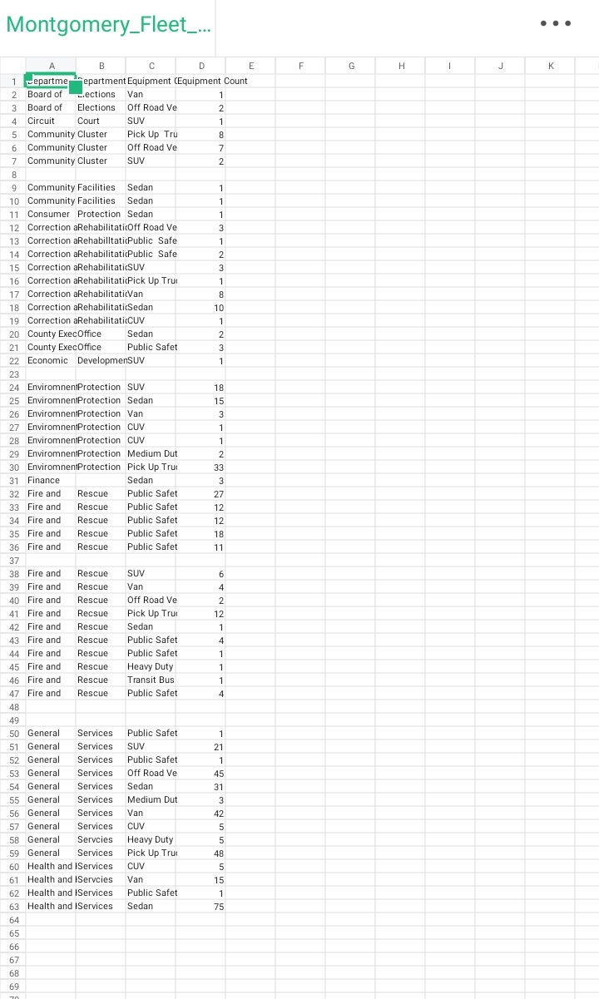
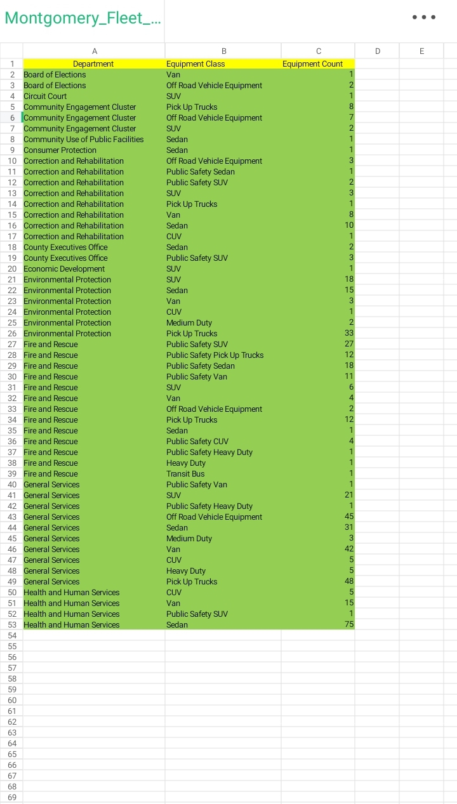

Montgomery County Fleet Data Cleaning

Before vs. After

Before (Messy):

After (Cleaned):

Goal
Clean a messy government fleet dataset by fixing truncated text, merging split columns, and standardizing department names for clear analysis.

What I Did in Excel
 
Merged split columns: Combined separate department columns into one clean column (e.g., "Board" + "Elections" → "Board of Elections")
- Fixed truncated text: Expanded cut-off names (e.g., "Environmen" → "Environmental Protection")
- Corrected spelling errors: Fixed misspelled department and equipment names throughout the dataset
- Standardized data: Corrected inconsistent labels like "Public Safet" to "Public Safety"
- Removed blanks: Deleted empty rows to create a clean, continuous dataset
- Formatted as Table: Applied table formatting with color-coded headers for readability

Result
Transformed a messy, hard-to-read spreadsheet into a clean, analysis-ready table showing equipment counts across 10+ county departments.

 Tools
Microsoft Excel (Data Cleaning, Merging Columns, Remove Duplicates, Format as Table)
